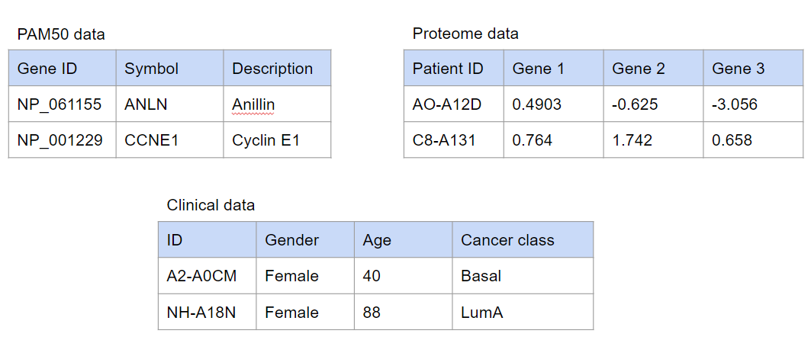
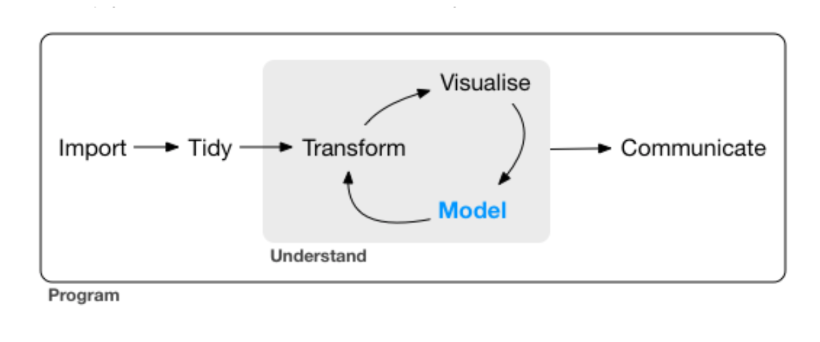
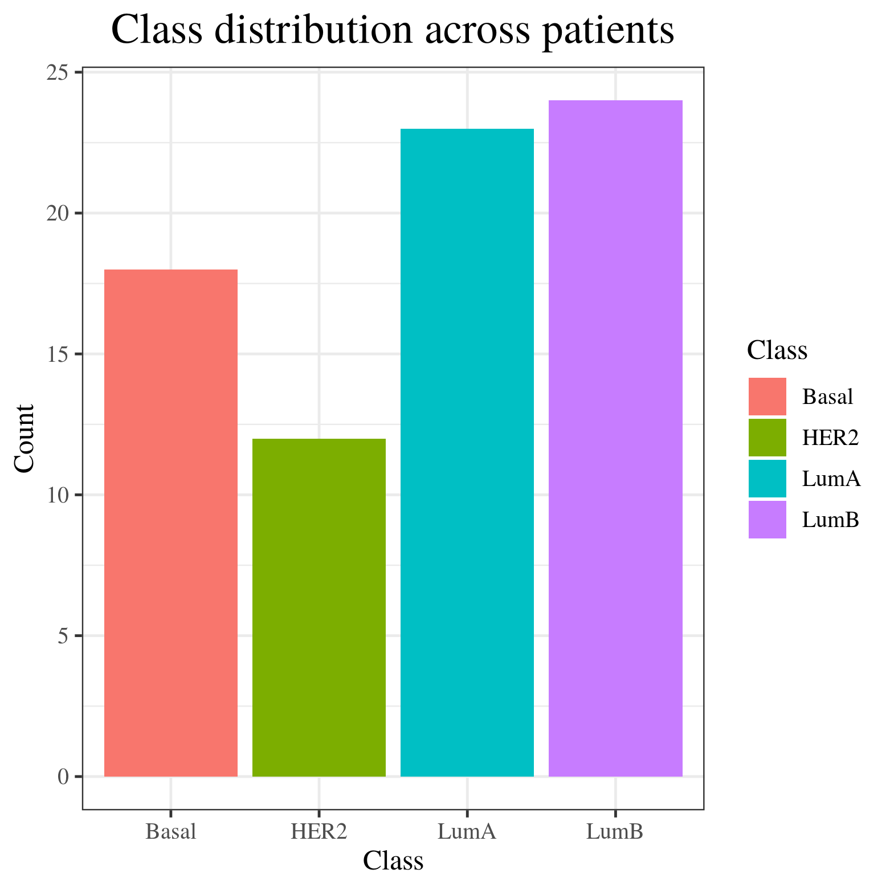
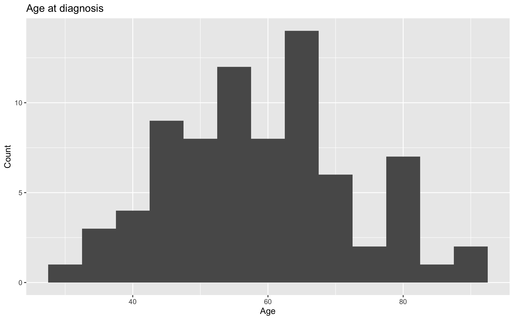
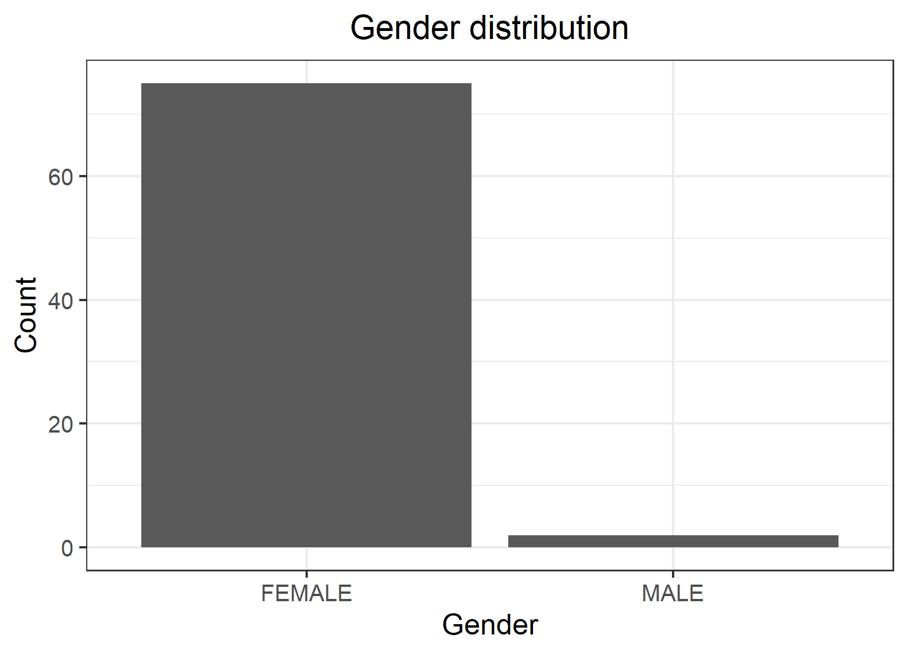
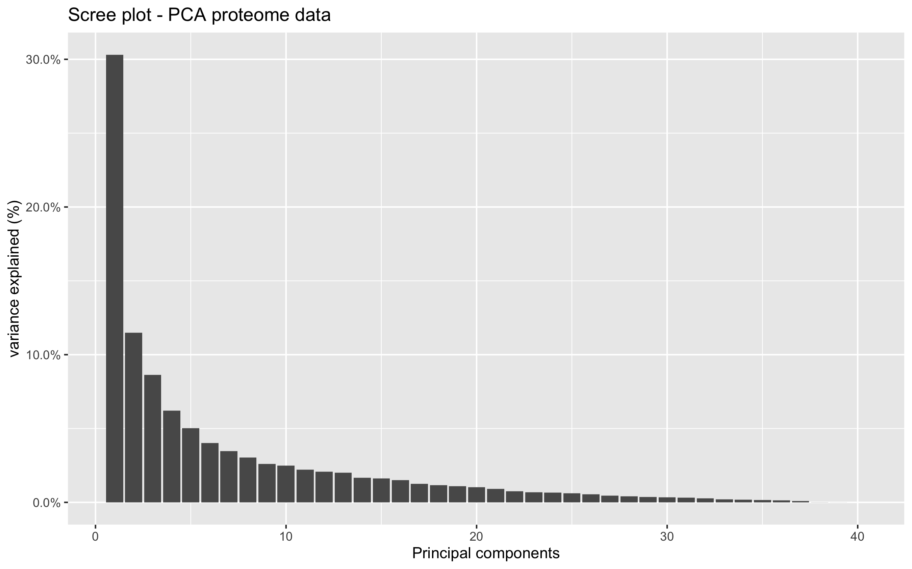

<style>
/* Fonts and Spacing */
article p, article li, article li.build, section p, section li{
  font-family: 'Open Sans','Helvetica', 'Crimson Text', 'Garamond',  'Palatino', sans-serif;
  text-align: justify;
  font-size:20px;
  line-height: 1.5em;
  color: Black;
}
h2 { /* Header 2 */
font-size: 24px;
#color: Black;
}
  
body{ /* Normal */
font-size: 8px;
color: Black;
}
</style>

h2.title {
font-size: 8px;
#color: #a9a9a9;
text-align: center;
}
```{r setup, include=FALSE}
knitr::opts_chunk$set(echo = FALSE)
```


```{r, echo=FALSE,message=FALSE}
# Clear workspace
# ------------------------------------------------------------------------------
rm(list = ls())

# Load libraries
# ------------------------------------------------------------------------------
library("tidyverse")
library("pheatmap")
library("ggplot2")
library("gridExtra")
# Define functions (DELETE IF NOT USED)
# ------------------------------------------------------------------------------
# Load data
# ------------------------------------------------------------------------------

df <- read_csv(file = "../data/02_joined_data_aug.csv")

# check the datasets in tables
proteome_raw_data <- as_tibble(read_csv(file = "../data/_raw/77_cancer_proteomes_CPTAC_itraq.csv")) # -> rows x cols - 12,553 x 86
clinical_raw_data <- as_tibble(read_csv(file = "../data/_raw/clinical_data_breast_cancer.csv"))  # -> rows x cols - 105 x 30
pam50_raw_data <- as_tibble(read_csv(file = "../data/_raw/PAM50_proteins.csv"))
```


## Introduction
### Dataset:
* breast cancer
* proteomics by mass spectrometry

### Goal:
* Explore the dataset for patterns

* Create models to identify the breast cancer subclasses


## Materials and Methods
### Dataset:
```{r}

```
## Materials and Methods:

*Exploratory data analysis of clinical data

* PCA

* K-means

* ANN

```{r}

```

## Exploratory Data Analysis 1/5
### 

```{r}
knitr::include_graphics("../results/03_EDA_boxplot_combined.png")
```


## Exploratory Data Analysis 2/5
### 
```{r}

```

## Exploratory Data Analysis 2/5
### 
```{r}

```

## Exploratory Data Analysis 
### 
```{r}

```

## Exploratory Data Analysis 
### 
```{r}
knitr::include_graphics("../results/04_PCA.png")
```

## Exploratory Data Analysis 
### 
```{r}

```

## Exploratory Data Analysis 
### 
```{r}
knitr::include_graphics("../results/04_PCA_kmeans.png")
```

## ANN model confusion matrix
NEED PLOT IMAGE
```{r,out.width = "700px", fig.align="center"}
knitr::include_graphics("../results/05_ANN_performance.png")
```

## ANN representation

```{r, out.width="800px", fig.align="center"}
knitr::include_graphics("../results/05_")
```
Figure: PCA plots annotated using the different 

<!-- ## Other modelling -->

<!-- - in progress: -->
<!--     - Classification tree (supervised) -->
<!--     - Clustering (knn) -->
<!--     - Linear model ( <dev class= "red"> Only AGE as a continuous variable </dev>) -->
<!--     - Logistic regression (multiclass) -->


## ANN confusion matrix

NEED IMAGE


```{r,out.width = "750px"}
knitr::include_graphics("../doc/Rmd_sup/05_ANN_performance.png")
```

## Current "file" state


```{r, out.width="700px"}
knitr::include_graphics("../doc/Rmd_sup/currentfiles.PNG")
```

## Discussion


* What could have been better

* further work


## End
```{r}
knitr::include_graphics("../doc/Rmd_sup/suggestions.jpg")
```

