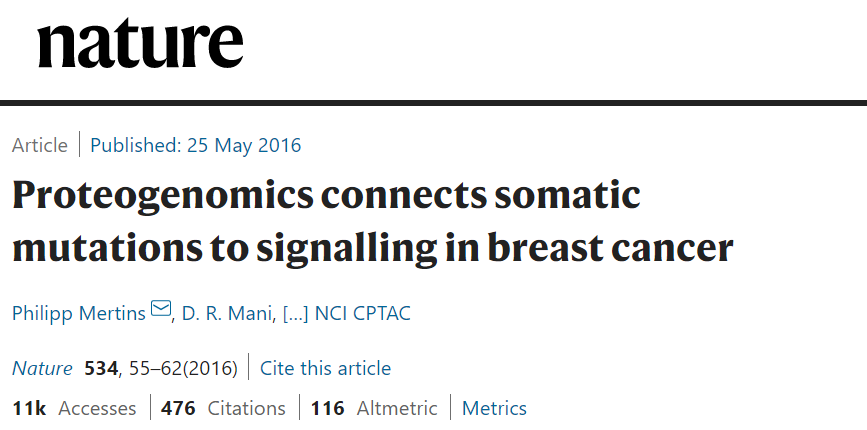

<style type="text/css">

main-container {
    max-width: 1200px !important;
    margin-left: auto;
    margin-right: auto;
  }
  
body{ /* Normal */
font-size: 17px;
color: Black;
}

td { /* Table */
font-size: 14px;
}

h1.title {
font-size: 34px;
#color: Black;
text-align: center;
#margin-top: 20em;
}
h2.title {
font-size: 18px;
#color: #a9a9a9;
text-align: center;
}

h4.author { /* Header 4 - the author and data headers use this too */
font-size: 16px;
font-family: "Times New Roman", Times, serif;
#color: DarkGray;
text-align: center;
}
h4.date { /* Header 4 - the author and data headers use this too */
font-size: 16px;
font-family: "Times New Roman", Times, serif;
#color: Black;
text-align: center;
}

h1 { /* Header 1 */
font-family: italic
font-size: 24px;
#color: Black;
}

h2 { /* Header 2 */
font-size: 20px;
#color: Black;
}

h3 { /* Header 3 */
font-size: 18px;
font-family: "Times New Roman", Times, serif;
#color: Black;
}

.btn {
border-width: 0 0px 0px 0px;
font-weight: normal;
text-transform: ;
}

.btn-default {
color: #2ecc71;
background-color: #ffffff;
border-color: #ffffff;
}

p.caption {
  font-size: 1em;
  font-family: "Times New Roman", Times, serif;
  color: #636363;
}

pre {
    border: 0px solid #cccccc;
    border-radius: 0px;
 }


/* ---------- Links ----------------- */
a {
  color: #69b3a2;
}
a:hover {
  color: #69b3a2;
}


/* ---------- TOC ----------------- */
#TOC {
  position: fixed;
  left: 0;
  top: 0;
  width: 200px;
  height: 100%;
  overflow:auto;
}
.tocify {
  border: none;
  color: grey;
  border-radius: 0px;
}
.list-group-item.active {
    color: #69b3a2;
    background-color: white;
    border-left: solid;
    border-color: #69b3a2;
}
.list-group-item:hover {
    color: #69b3a2;
    background-color: white;
    border-left: solid;
    border-color: #69b3a2;
}
.tocify-extend-page {
  display: none;
}

/* ------ This is just to fix the bug on Safari where table of content is on top of content */
.toc-content {
  margin-left: 210px
}

</style>
`

```{r libraries, eval=TRUE,  message=FALSE, warning=FALSE, echo=FALSE}
# Libraries
# Load paths & libraries

library(tidyverse)
library(pheatmap)   # heat map plot
library(DT)
library(RColorBrewer)    # colot scheme for plots
library(VennDiagram)
library(tidyverse)
``` 
```{r setup, include=FALSE}
knitr::opts_chunk$set(echo = TRUE)
```

*Original Article*
```{r}


```

# Background

Abstract
"Somatic mutations have been extensively characterized in breast cancer, but the effects of these genetic alterations on the proteomic landscape remain poorly understood. Here we describe quantitative mass-spectrometry-based proteomic and phosphoproteomic analyses of 105 genomically annotated breast cancers, of which 77 provided high-quality data. ..."

Sample description:
105 breast tumors previously characterized by the TCGA (look this up) were selected for proteomic analysis after histopathological documentation (Supplementary Tables 1 and 2). The cohort included a balanced representation of PAM50-defined intrinsic subtypes9  including 25 basal-like, 29 luminal A, 33 luminal B, and 18 HER2 (ERBB2)-enriched tumors, along with 3 normal breast tissue samples.  ...

After filtering for observation in at least a quarter of the samples (Supplementary Methods, Extended Data Fig. 1b) 12,553 proteins (10,062 genes) and 33,239 phosphosites, with their relative abundances quantified across tumors, were used in subsequent analyses in this study.

Due to the heterogeneous nature of breast tumors11–13 , and because proteomic analyses were performed on tumor fragments that were different from those used in the genomic analyses, rigorous pre-specified sample and data QC metrics were implemented14,15 . Extensive analyses concluded that 28 of the 105 samples were compromised by protein degradation. These samples were excluded from further analysis with subsequent informatics focused on the 77 tumor samples and three biological replicates.

While these analyses detected a number of single amino-acid variants (SAAVs), frameshifts, and splice junctions, including splice isoforms that had been detected as only single transcript reads by RNA-seq (Fig. 1b, Supplementary Table 5), the number of genomic and transcriptomic variants that were confirmed as peptides by MS was low (Supplementary Discussion).

Clustering analysis:
Transcriptional profiling has converged on four major breast cancer subtypes: Luminal A and B, basal and HER2-enriched1,9 . To investigate the extent to which the PAM50 “intrinsic” breast cancer classification scheme is reflected or refined on the proteome level in the CPTAC samples, clustering analyses were first restricted to the reduced set of PAM50 genes. When RNA data for the 50 PAM50 genes were clustered directly (without using a classifier), the clustering was similar to the TCGA PAM50 annotation (second annotation bar in Fig. 3a). Restricting both the RNA and proteome data to the set of 35 PAM50 genes observed in the proteome produced a similar result (bottom two annotation bars in Fig. 3a), and all the major PAM50 groups were recapitulated in the proteome almost as well as in the RNA data. This indicates that although different tissue sections of the same tumors were used for RNA-seq and protein analysis, very similar subtype-defining features can be observed in both data types.

## External links:

###iTRAQ:
source: [iTRAQ article](https://www.ncbi.nlm.nih.gov/pubmed/17177251)
A novel, MS-based approach for the relative quantification of proteins, relying on the derivatization of primary amino groups in intact proteins using isobaric tag for relative and absolute quantitation (iTRAQ) is presented. Due to the isobaric mass design of the iTRAQ reagents, differentially labeled proteins do not differ in mass; accordingly, their corresponding proteolytic peptides appear as single peaks in MS scans. Because quantitative information is provided by isotope-encoded reporter ions that can only be observed in MS/MS spectra, we analyzed the fragmentation behavior of ESI and MALDI ions of peptides generated from iTRAQ-labeled proteins using a TOF/TOF and/or a QTOF instrument.

### TCGA study:
source: [The Cancer Genome Atlas Program](https://www.cancer.gov/about-nci/organization/ccg/research/structural-genomics/tcga)
The Cancer Genome Atlas (TCGA), a landmark cancer genomics program, molecularly characterized over 20,000 primary cancer and matched normal samples spanning 33 cancer types. This joint effort between the National Cancer Institute and the National Human Genome Research Institute began in 2006, bringing together researchers from diverse disciplines and multiple institutions.


### CPTAC study:
source: [The National Cancer Institute’s Clinical Proteomic Tumor Analysis Consortium](https://proteomics.cancer.gov/programs/cptac)
The National Cancer Institute’s Clinical Proteomic Tumor Analysis Consortium (CPTAC) is a national effort to accelerate the understanding of the molecular basis of cancer through the application of large-scale proteome and genome analysis, or proteogenomics. Launched in 2011, CPTAC pioneered the integrated proteogenomic analysis of colorectal, breast and ovarian cancer to reveal new insights into these cancer types, such as identification of proteomic-centric subtypes, prioritization of driver mutations by correlative analysis of copy number alterations and protein abundance, and understanding cancer-relevant pathways through posttranslational modifications. 

### PAM50 & Breast Cancer subtypes:
source: [PCA-PAM50: article](https://www.nature.com/articles/s41598-019-44339-4)
The PAM50 classifier is widely used for breast tumor intrinsic subtyping based on gene expression. Clinical subtyping, however, is based on immunohistochemistry assays of 3–4 biomarkers. Subtype calls by these two methods do not completely match even on comparable subtypes. Nevertheless, the estrogen receptor (ER)-balanced subset for gene-centering in PAM50 subtyping, is selected based on clinical ER status. There are four widely-accepted intrinsic subtypes based on PAM (Prediction Analysis of Microarray) 505 gene expression profiles: Luminal A (LA), Luminal B (LB), Her2-enriched (Her2) and basal-like (Basal).

# AIM


# Methodology:

## Data preprocessing:

### Cleaning

### Joining

### Augmenting

### Exploratory analysis

### Modelling


# Results


# References


# Discussion


Session Info:
```{r, SessionInfo}
print(date)
sessionInfo()
```
