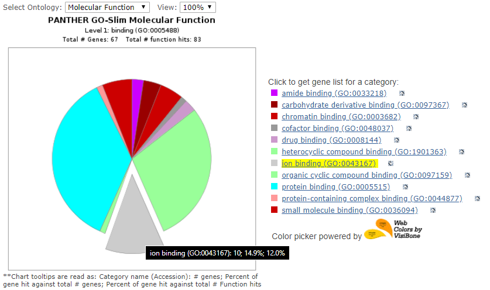
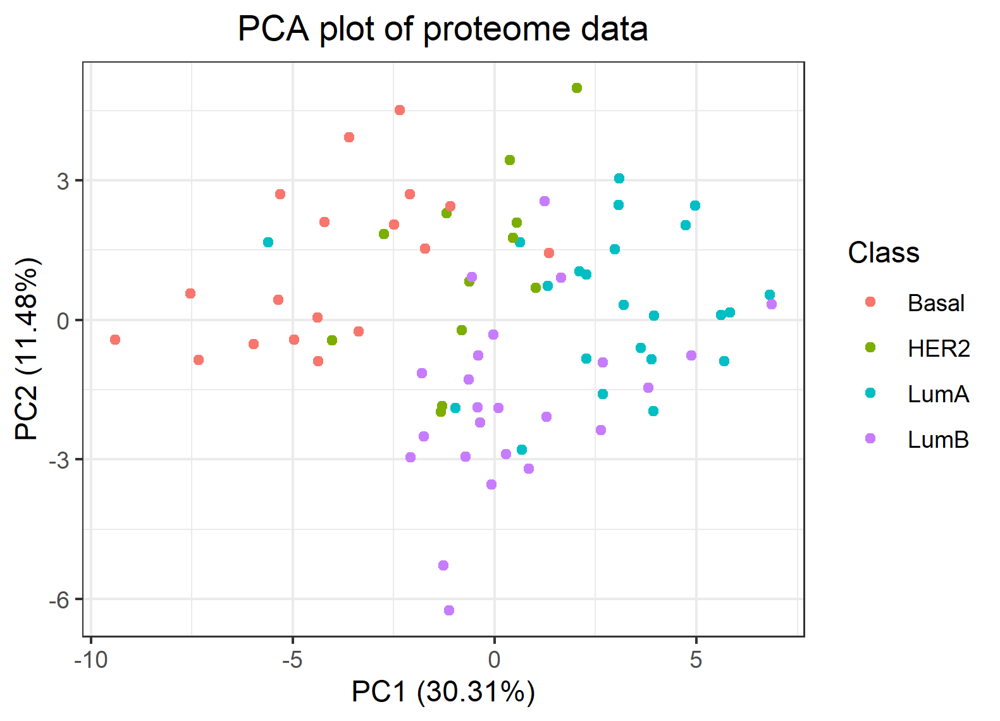
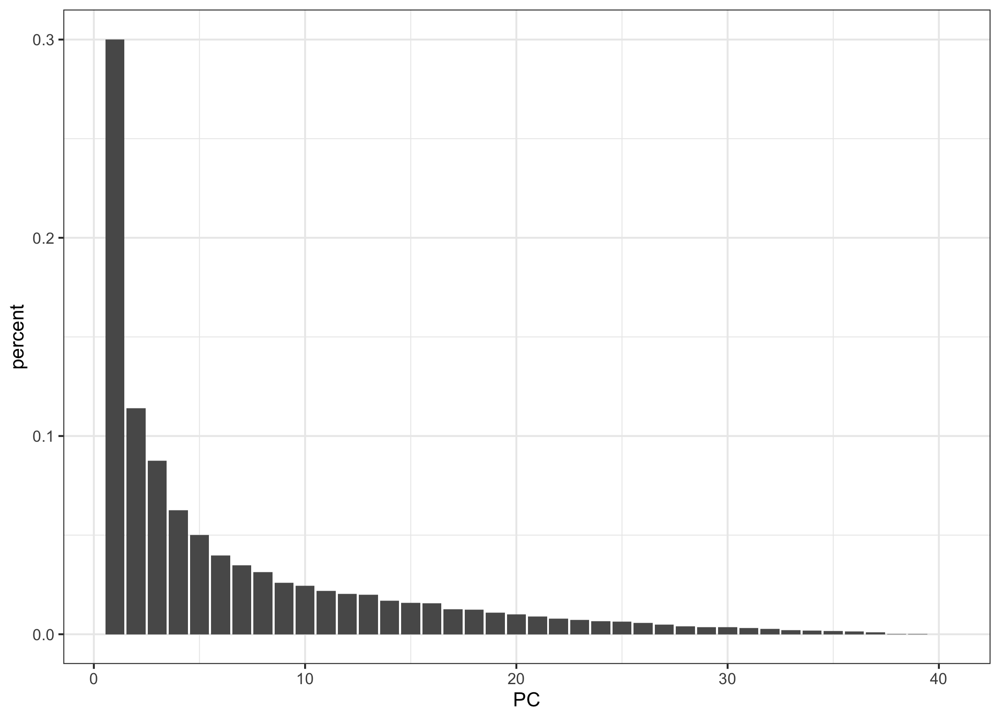

```{r setup, include=FALSE}
knitr::opts_chunk$set(echo = FALSE)
```


```{r, echo=FALSE,message=FALSE}
# Clear workspace
# ------------------------------------------------------------------------------
rm(list = ls())

# Load libraries
# ------------------------------------------------------------------------------
library("tidyverse")
library("pheatmap")
library(ggplot2)
# Define functions (DELETE IF NOT USED)
# ------------------------------------------------------------------------------
# Load data
# ------------------------------------------------------------------------------

df <- read_csv(file = "../data/02_joined_data_clean.csv")

# check the datasets in tables
proteome_raw_data <- as_tibble(read_csv(file = "../data/_raw/77_cancer_proteomes_CPTAC_itraq.csv")) # -> rows x cols - 12,553 x 86
clinical_raw_data <- as_tibble(read_csv(file = "../data/_raw/clinical_data_breast_cancer.csv"))  # -> rows x cols - 105 x 30
pam50_raw_data <- as_tibble(read_csv(file = "../data/_raw/PAM50_proteins.csv"))
```


## Dataset
.exclaim .reveal .state-background {
  background: red;
} 
{data-background="doc/Rmd_sup/bckground.jpeg"}
```{r}
knitr::include_graphics("Rmd_sup/article_banner.PNG")
```

## Key concepts

- **iTRAQ:** A novel, MS-based approach for the relative quantification of proteins

-  **TCGA:** The Cancer Genome Atlas (TCGA), a landmark cancer genomics program

- **CPTAC:** The National Cancer Institute’s Clinical Proteomic Tumor Analysis Consortium (CPTAC)

- **PAM50:** The PAM50 classifier is widely used for breast tumor intrinsic subtyping based on gene expression

## Aim:

As rate of oncological diseases in the world keeps rising, there is an increased need for better diagnostic tools and treatments.

- **Key aims** : To use the TCGA Breat Cancer proteomic dataset that is accompanied by clinical observations and apply reproducible research methodology to: 
    - <div class="red">Explore the dataset for **patterns** between the _clinical_ and _expression_ data </div>
    - <div class="blue">Apply Machine Learning techniques to **create models** to help identify the _Tumor subclasses_ </div>

- **Additionally**: 
    - To apply reproducible research methodology while conducting this project

## Importance

**Importance**

- DIAGNOSTICS:
    - new methods for tumor typing
    - more accurate course of treatments
    - new biomarkers for diagnostics
    
- DRUG:
    - new targets for treatment
    - increased treatment efficacy 
    
- RESEARCH:
    - treatment effects treatment on tumor landscapes


## Data Overview 1/3
### Clinical Data
```{r, warning=FALSE, message=FALSE}
#print("Dimentions:")
dim(clinical_raw_data)
#print("Attributes")
#colnames(clinical_raw_data)[1:10]

clinical_raw_data %>%
  keep(is.numeric) %>% 
  gather() %>% 
  ggplot(aes(value)) +
    facet_wrap(~ key, scales = "free") +
    geom_histogram()
```

## Data Overview 2/3
### Expression Data
```{r, warning=FALSE, message=FALSE}
#print("Dimentions:")
dim(proteome_raw_data)
#print("Attributes")
#colnames(clinical_raw_data)[1:10]

proteome_raw_data %>%
  select(-c(RefSeq_accession_number, gene_symbol, gene_name)) %>%
  select(starts_with("B")) %>% 
  keep(is.numeric) %>% 
  gather() %>% 
  ggplot(aes(value)) +
    facet_wrap(~ key, scales = "free") +
    geom_histogram()
```

## Data Overview 3/3
### Expression Data
```{r}
print("Dimentions:")
dim(pam50_raw_data)
colnames(pam50_raw_data)
```

## Data Preparation: Cleaning

<div class="red"> - Clinical data:
    - more observations than final sample size
    - no missing values
  </div>
  
<div class="blue"> - Expression data:
  - Missing values across patient samples (differences in expression profiles) >> fill with mean() or remove the patient
  - Redundant columns  >> removed
  - Patient IDs extracted and reconverted
  </div>


## Exploratory analysis:
Potential patterns from the phenotype data: 
- Clinical observations:

```{r, message=FALSE, warning=FALSE}
clinical <- read_csv(file = "../data/02_clinical_V.csv")


# Preliminary fast hand plots
# ------------------------------------------------------------------------------
p1 <- clinical %>% 
  ggplot(mapping = aes(clin_Gender, fill = clin_Tumor)) +
  geom_bar() +
  theme(axis.text.x = element_text(angle = 45,hjust = 1))
  
#ggsave("results/gender_vs_tumortype.png", device = "png")    

p2 <- clinical %>% 
  ggplot(mapping = aes(y = clin_Tumor, x =clin_Metastasis_Coded, colour = clin_Tumor)) +
  geom_jitter(width = 0.1)+ theme(axis.text.x = element_text(angle = 45,hjust = 1))
# ggsave("results/metastatis_vs_tumortype.png", device = "png")

p3 <- clinical %>% 
  ggplot(mapping = aes(y = clin_Tumor, x =clin_methylation_Clusters, colour = clin_Tumor)) +
  geom_jitter(width = 0.1)+ theme(axis.text.x = element_text(angle = 45,hjust = 1))
# ggsave("results/methylCluster_vs_tumorType.png", device = "png")

p4 <- clinical %>% 
  ggplot(mapping = aes(y = clin_Tumor, x =clin_Age_at_Initial_Pathologic_Diagnosis, colour = clin_PAM50_mRNA)) +
  geom_jitter(width = 0.1)+ theme(axis.text.x = element_text(angle = 45,hjust = 1))
# ggsave("results/age_vs_cellTyp.png", device = "png")
library("ggpubr")
ggarrange(p1, p2, p3, p4, nrow = 2, ncol = 2)
```
## Data Preparation: Joining

- Combining Clinical data and Expression data based on patient IDs
                  - dropping the unmatched observations
                  
                  
```{r, warning=FALSE, message=FALSE}
df %>%   select(patient_ID,
                starts_with("NP_"),
                PAM50_mRNA) %>%
  pivot_longer(cols = starts_with('NP_')) %>%
  ggplot(aes(x=value, fill=patient_ID)) + geom_density(alpha=0.5) + 
  geom_vline(xintercept = c(-1, 1), linetype="dashed") + 
  ggtitle("Density plot: Gene expression for each patient") +
  theme_bw(base_family = "Times", base_size = 10) 
```


## Tissue specific expression landscape

### Heatmap
```{r}
knitr::include_graphics("../results/proteom_heatmap_celltype.png")
```

## Gene Ontology landscape

Explore the gene clustering profiles using Gene ontology PANTHER resourse

< coming (... <dev class= "green"> EXAMPLE ... </dev>) >

```{r, out.width="650px"}

```


## Modelling data: PCA
```{r image_grobs, fig.show = "hold", out.width = "50%", fig.align = "default"}



```


## ANN model confusion matrix

```{r,out.width = "800px"}
knitr::include_graphics("../results/05_ANN_performance.png")
```


## Other modelling

- in progress:
    - Classification tree
    - Linear model
    - Logistic regression (multiclass)


## Shiny application

Attempt to create an interactive plot as a web application


## Are we on track ?
```{r}
knitr::include_graphics("../doc/Rmd_sup/suggestions.jpg")
```


```{r}

```

