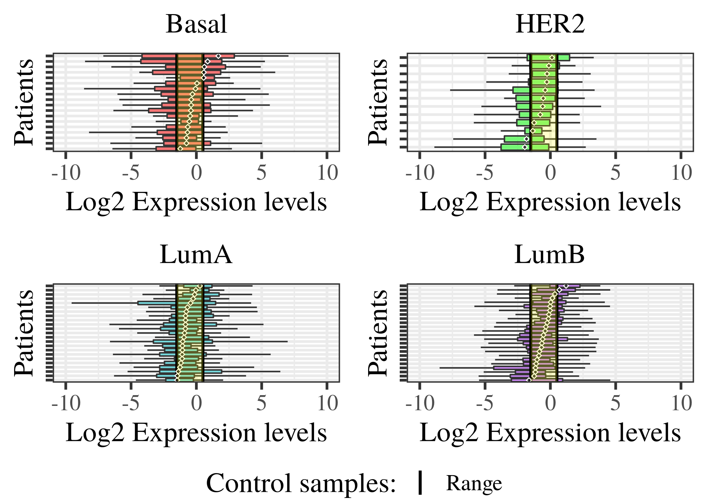
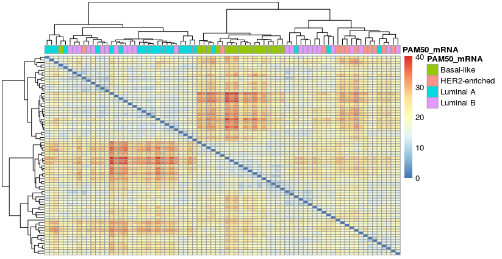
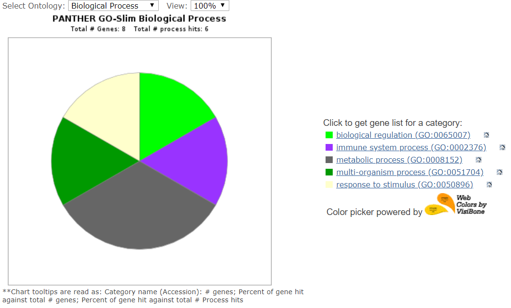
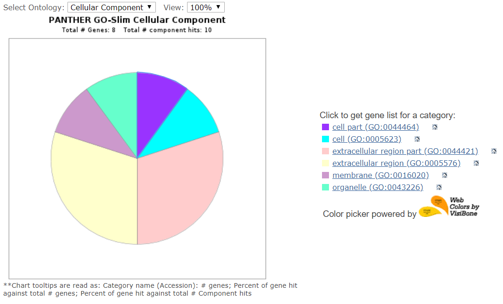
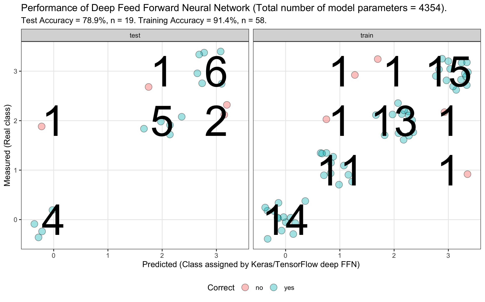
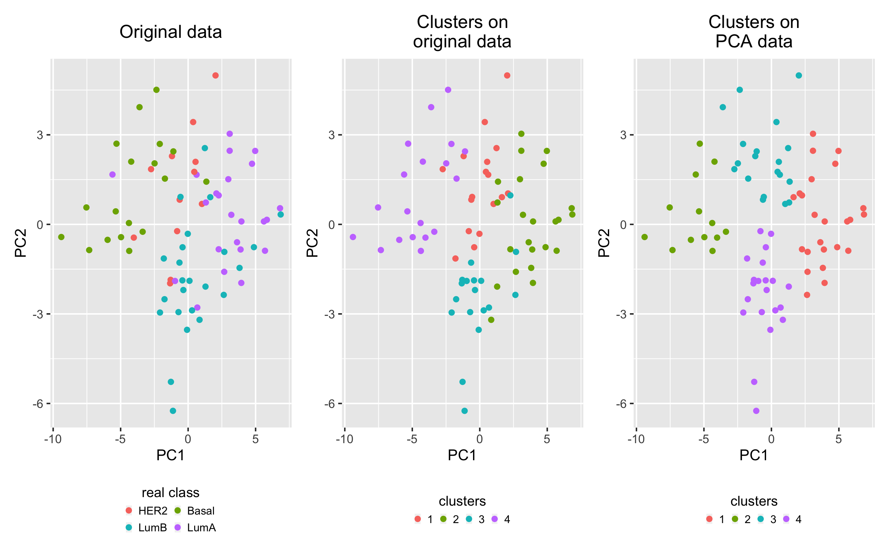
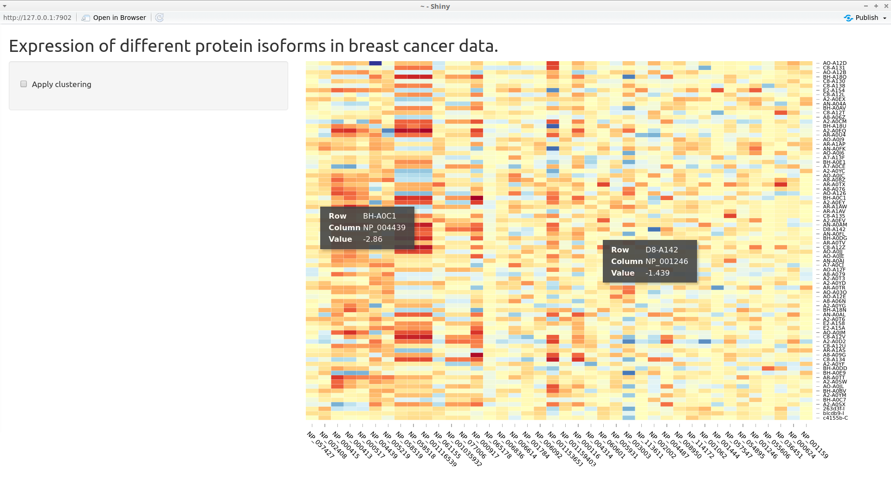
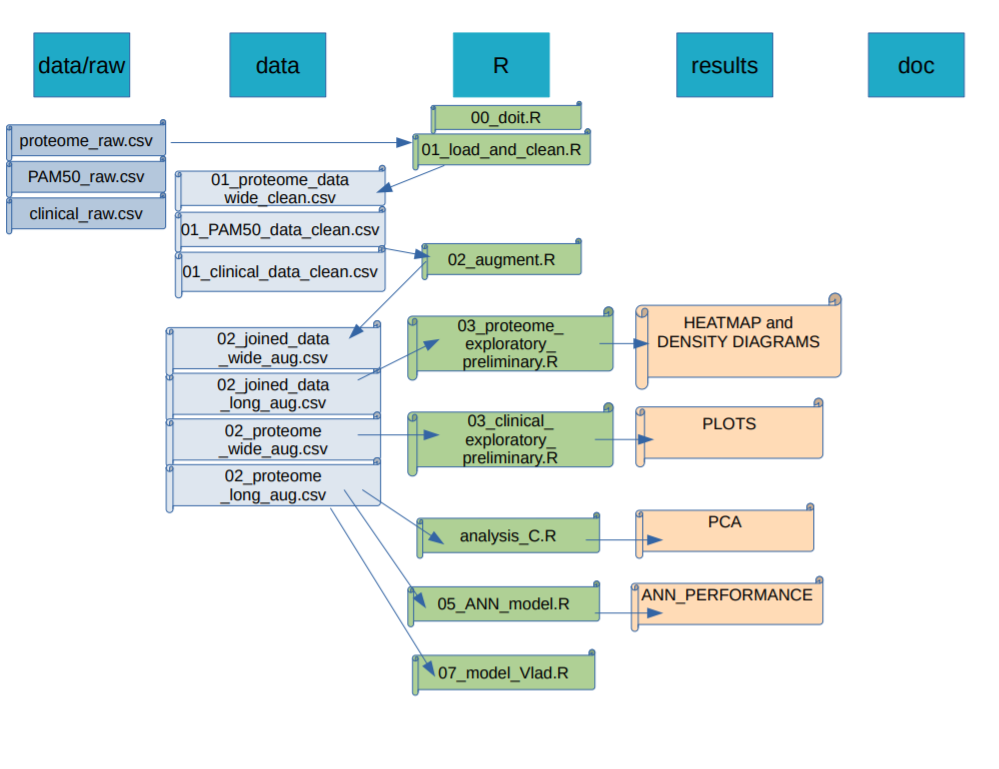

<style>
/* Fonts and Spacing */
article p, article li, article li.build, section p, section li{
  font-family: 'Open Sans','Helvetica', 'Crimson Text', 'Garamond',  'Palatino', sans-serif;
  text-align: justify;
  font-size:20px;
  line-height: 1.5em;
  color: Black;
}
h2 { /* Header 2 */
font-size: 24px;
#color: Black;
}
  
body{ /* Normal */
font-size: 8px;
color: Black;
}
</style>

h2.title {
font-size: 8px;
#color: #a9a9a9;
text-align: center;
}
```{r setup, include=FALSE}
knitr::opts_chunk$set(echo = FALSE)
```


```{r, echo=FALSE,message=FALSE}
# Clear workspace
# ------------------------------------------------------------------------------
rm(list = ls())

# Load libraries
# ------------------------------------------------------------------------------
library("tidyverse")
library("pheatmap")
library("ggplot2")
library("gridExtra")
# Define functions (DELETE IF NOT USED)
# ------------------------------------------------------------------------------
# Load data
# ------------------------------------------------------------------------------

df <- read_csv(file = "../data/02_joined_data_aug.csv")

# check the datasets in tables
proteome_raw_data <- as_tibble(read_csv(file = "../data/_raw/77_cancer_proteomes_CPTAC_itraq.csv")) # -> rows x cols - 12,553 x 86
clinical_raw_data <- as_tibble(read_csv(file = "../data/_raw/clinical_data_breast_cancer.csv"))  # -> rows x cols - 105 x 30
pam50_raw_data <- as_tibble(read_csv(file = "../data/_raw/PAM50_proteins.csv"))
```


## Dataset

```{r}
knitr::include_graphics("Rmd_sup/article_banner.PNG")
```

## Key concepts

- **iTRAQ:** A novel, MS-based approach for the relative quantification of proteins

-  **TCGA:** The Cancer Genome Atlas (TCGA), a landmark cancer genomics program

- **CPTAC:** The National Cancer Institute’s Clinical Proteomic Tumor Analysis Consortium (CPTAC)

- **PAM50:** The PAM50 classifier is widely used for breast tumor intrinsic subtyping based on gene expression

## Aim:

As rate of oncological diseases in the world keeps rising, there is an increased need for better diagnostic tools and treatments.

- **Key aims** : To use the TCGA Breat Cancer proteomic dataset that is accompanied by clinical observations and apply reproducible research methodology to: 
    - <div class="red">Explore the dataset for **patterns** between the _clinical_ and _expression_ data </div>
    - <div class="blue">Apply Machine Learning techniques to **create models** to help identify the _Tumor subclasses_ </div>

- **Additionally**: 
    - To apply reproducible research methodology while conducting this project

## Importance

**Importance**

- DIAGNOSTICS:
    - new methods for tumor typing
    - more accurate course of treatments
    - new biomarkers for diagnostics
    
- DRUG:
    - new targets for treatment
    - increased treatment efficacy 
    
- RESEARCH:
    - treatment effects treatment on tumor landscapes


## Data Overview 1/3
### Clinical Data
```{r, warning=FALSE, message=FALSE}
#print("Dimentions:")
dim(clinical_raw_data)
#print("Attributes")
#colnames(clinical_raw_data)[1:10]

clinical_raw_data %>%
  keep(is.numeric) %>% 
  gather() %>% 
  ggplot(aes(value)) +
    facet_wrap(~ key, scales = "free") +
    geom_histogram()
```

## Data Overview 2/3
### Expression Data
```{r, warning=FALSE, message=FALSE}
#print("Dimentions:")
dim(proteome_raw_data)
#print("Attributes")
#colnames(clinical_raw_data)[1:10]

proteome_raw_data %>%
  select(-c(RefSeq_accession_number, gene_symbol, gene_name)) %>%
  select(starts_with("B")) %>% 
  keep(is.numeric) %>% 
  gather() %>% 
  ggplot(aes(value)) +
    labs(x = "Log2 Expression") +
    facet_wrap(~ key, scales = "free") +
    geom_histogram()
```

## Data Overview 3/3
### PAM50 panel


```{r}
print("Dimentions:")
dim(pam50_raw_data)
colnames(pam50_raw_data)
```

## Data Preparation: Cleaning

<div class="red"> - Clinical data:
    - more observations than final sample size
    - no missing values
  </div>
  
<div class="blue"> - Expression data:
  - Missing values across patient samples (differences in expression profiles) >> fill with mean() or remove the patient
  - Redundant columns  >> removed
  - Patient IDs extracted and reconverted
  </div>


## Exploratory analysis:
Exploring Clinical Dataset patterns:

```{r EDAclinical, warning=FALSE, message=FALSE, out.width="750px",fig.align = "center" }

# Preliminary fast hand plots
# ------------------------------------------------------------------------------
knitr::include_graphics(path = "../results/03_EDA_grid4_combo.png")
```
Figure: Exploratory analysis of clinical data

## Data Preparation: Joining 
Combining Clinical data and Expression data based on patient IDs:
- This allows for splitting the proteomic data based on PAM50 markers subgroups
                  
```{r boxplots, warning=FALSE, message=FALSE, out.width="700px",fig.align = "center"}

```

- Figure: Boxplot of individual PAM50 groups based on differential gene expression. Dashed lines indicates the maximum range of expression for control, non-tumor, samples.

## Tissue specific expression landscape
### Heatmap
```{r Heatmap, warning=FALSE, message=FALSE,fig.align = "center"}

```

- Figure: Heatmap of patients' expression data of PAM50 gene set

## Gene Ontology landscape

Explore the gene clustering profiles using Gene ontology PANTHER resourse

< coming (... <dev class= "green"> EXAMPLE ... </dev>) >

```{r, out.width="350px", fig.show="hold",fig.align = "center"}



```


## Modelling data: PCA
```{r image_grobs, fig.align = "default", out.width=c("85%","40%"), }

knitr::include_graphics(c("../results/04_PCA.png","../results/04_scree.png"))


```


## ANN model confusion matrix

```{r,out.width = "800px"}

```

## NEW SLIDE
 ### PLEASE ADD INFO
PCA kmeans

```{r, out.width="800px", fig.align="center"}

```


## Other modelling

- in progress:
    - Classification tree (supervised)
    - Clustering (knn)
    - Linear model ( <dev class= "red"> Only AGE as a continuous variable </dev>)
    - Logistic regression (multiclass)


## Shiny application

Currently working as an <dev class="red2">**Interactive Heatmap**</dev>

```{r,out.width = "800px"}

```

## Current "file" state


```{r, out.width="700px"}

```


## Are we on track ?
```{r}

```


```{r}

```

